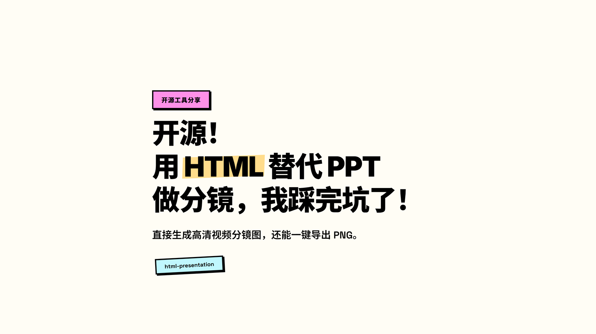
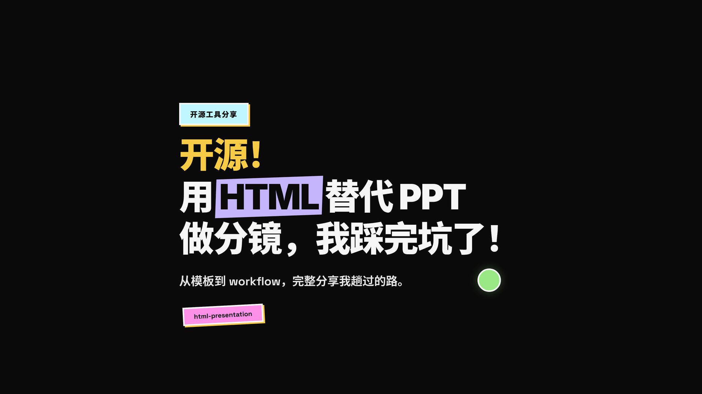
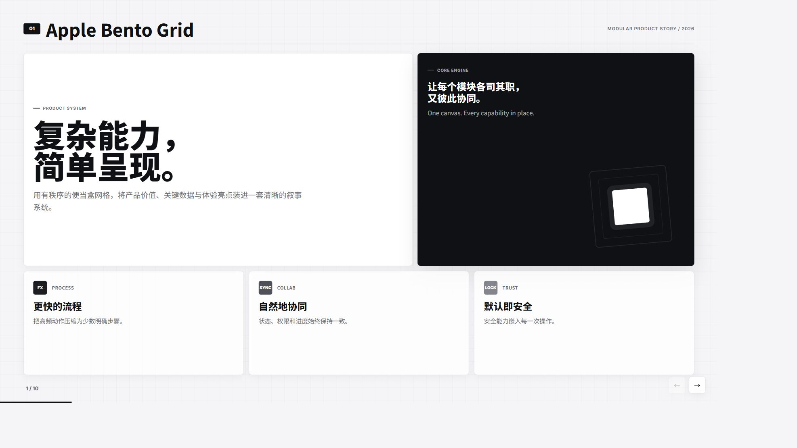

# HTML Presentation · 视频友好版

<p align="center">
  <strong>用 HTML 做视频分镜的更好方式</strong>
</p>

<p align="center">
  专为 <strong>B 站讲解视频</strong>、<strong>知识分享</strong>、<strong>教程分镜</strong> 优化的 HTML 幻灯片工具。
</p>

<p align="center">
  <a href="https://www.bilibili.com/video/BV1HToiBCEwg">📺 项目使用教程</a> ·
  <a href="https://www.bilibili.com/video/BV1g5j46iE5C">🎬 为什么用 HTML 替代 PPT</a> ·
  <a href="https://juanjuanjie.github.io/html-presentation/">🌐 在线模板广场</a>
</p>

---

## 这是什么？

这是一个面向 AI 协作的 **HTML 演示与视频分镜生成工具**。主页可以直接导入稿件、选择模式和视觉模板，再生成一份包含完整稿件、规则与模板源码的 Agent 提示词：

- **演讲 HTML**：把逐字稿提炼为适合上课、分享和手动演示的页面。
- **导演 HTML**：把导演稿严格转换为一镜一页、保留逐镜口播和动效要求的分镜网页。
- 稿件只在当前浏览器页面中读取，不会上传或持久保存。
- 用带缩略图的模板选择器预览风格，再把完整提示词交给任意 AI 工具。
- 浏览器实时预览翻页节奏。
- 运行一条命令，导出 1920×1080 PNG 序列。
- 直接拖进剪辑软件，开始剪视频。

相比传统 PPT，它更适合被 AI 接管、被 Git 版本控制、被脚本批量处理。

## 核心特点

| 特性 | 说明 |
|------|------|
| **字号更大** | 标题与正文整体放大，远距离 / 小屏幕都清晰可读。 |
| **信息密度更低** | 每页一个重点，标题即结论。 |
| **左右大留白** | `10vw` 边距，避免被平台字幕、头像、按钮遮挡。 |
| **高对比配色** | 深黑背景 + 紫色/黄色强调，视频压缩后依然清晰。 |
| **单文件输出** | 所有 CSS、JS 内联，复制一个 HTML 即可开始制作。 |
| **一键导出 PNG** | 自动隐藏控件，输出干净分镜图。 |
| **双生成模式** | 同时覆盖“逐字稿 → 演讲 HTML”和“导演稿 → 导演 HTML”。 |
| **一镜一页校验** | 导演模式检查镜头编号是否从 01 连续递增，避免漏镜、跳号和误合并。 |
| **模板可视化选择** | 下拉选项同时显示缩略图、模板名和风格说明。 |
| **静态且隐私友好** | 不接入模型密钥，不上传稿件；生成的提示词可复制或下载。 |

## 在线模板广场

项目根目录的 [`index.html`](./index.html) 是 GitHub Pages 入口，包含三个相互独立的页面：

- **稿件 → HTML**：导入逐字稿或导演稿，选择模板并准备 Agent 提示词。
- **模板**：浏览主题、配色变体、真实封面和设计文档。
- **动效**：按需加载可复用的动效组件，避免拖慢主页面。

模板卡片和生成器均使用 `assets/previews/` 中的真实截图。更新模板视觉后，应同步更新对应预览图。

当前模板状态：

| 模板 | 页数 | 封面策略 | 适合场景 |
|------|------|----------|----------|
| **BlockFrame** | 11 | 第 1 页为「开源！用 HTML 替代 PPT 做分镜」项目封面，第 2 页保留原主题封面 | B 站教程、开源项目介绍、设计提案 |
| **BlockFrame Dark** | 11 | 第 1 页为暗色项目封面，第 2 页保留原主题封面 | 暗色视频分镜、高对比教程、视觉冲击型展示 |
| **Blue Professional** | 10 | 保留原专业商务封面 | B2B SaaS、投资者更新、咨询交付 |
| **Purple Gold Presentation** | 10 | 第 1 页替换为「PPT 正在被 HTML 淘汰」项目封面；新增黄黑浅色配色可切换 | 知识分享、教程视频、暗色电影感开场 |
| **Apple Bento Grid** | 10 | 保留原主题封面 | 产品发布、功能对比、数据仪表盘、路线图 |

每个模板卡片都提供「实时预览」和「设计文档」入口。

本项目已配置 GitHub Actions（`.github/workflows/pages.yml`）。上传到 GitHub 后，在仓库 **Settings → Pages** 中选择 **GitHub Actions** 作为部署来源，每次 push 到 `main` 都会自动部署到 GitHub Pages。

## 效果预览

| BlockFrame | BlockFrame Dark | Blue Professional | Purple Gold | Apple Bento Grid |
|---|---|---|---|---|
|  |  |  |  |  |

### 可选封面模板

| BlockFrame Classic | BlockFrame Dark Classic | Blue Professional Classic | Purple Gold Classic | Purple Gold Tutorial |
|---|---|---|---|---|
|  |  |  |  |  |

## 快速开始

### 先选择生成模式

| 模式 | 输入 | 分页方式 | 用途 |
|---|---|---|---|
| 演讲 HTML | 逐字稿 | 提炼观点，按内容分页 | 上课、演讲、手动翻页 |
| 导演 HTML | 导演稿 | 一镜一页，保留逐镜口播和动效 | 视频分镜、后续录制 |

首页选择模式 → 导入 `.md` / `.txt` 或粘贴全文 → 通过缩略图选择模板 → 准备 Agent 提示词 → 复制或下载到 AI 工具生成 HTML → 人工逐页校对。

提示词包含完整稿件、模板源码和对应规则。本站是静态工具，不直接调用 AI，也不上传或持久保存稿件；刷新前请保存自己的原稿。请通过 GitHub Pages 或本地 HTTP 服务使用，直接双击 `index.html` 时浏览器可能阻止读取模板。

导演模式会检查从“镜 01”开始的连续编号；不自动补镜、合并镜头或额外添加封面。详细规则见 [两种生成模式](docs/generation-modes.md)。

### 导演稿最小格式

每个镜头建议包含布局、画面、花字、图示、动效、转场和口播。镜头编号必须连续；每段口播只能属于一个镜头。

```md
## 镜 01｜开场提问

- 布局：居中大字，画面留白
- 画面：问题从模糊逐渐变清晰
- 花字：学编程还值得吗？
- 图示：抽象代码符号与一个问号
- 动效：花字淡入，问号轻微放大
- 转场：问题向左退出，衔接下一镜
- 口播：如果 AI 一秒钟就能写出你练三个月的代码，那你辛苦学的编程，还值钱吗？
```

导演 HTML 会保留每镜完整口播到 `.slide-subtitle` 节点，方便后续字幕时间轴或 Hyperframes 匹配。制作备注只用于生成，不应显示在最终画面中。

### 1. 创建演示文稿

复制一个主题模板：

```bash
cp themes/purple-gold-presentation/template.html my-presentation.html
```

用浏览器打开 `my-presentation.html`，按页面注释添加 `<section class="slide">...</section>` 内容即可。

### 2. 导出 PNG 分镜

安装依赖：

```bash
pip install -r requirements.txt
playwright install chromium
```

导出幻灯片图片：

```bash
python scripts/screenshot_html_slides.py themes/purple-gold-presentation/template.html -o slides_out
```

输出为 `slides_out/page_01.png`、`slides_out/page_02.png`...，分辨率 1920×1080，可直接拖入剪辑软件。

## 目录结构

```
html-presentation/
├── README.md                          # 本文件
├── SKILL.md                           # 视频友好设计规范
├── NOTICE.md                          # 致谢与来源声明
├── LICENSE                            # MIT 许可证
├── requirements.txt                   # Python 依赖
├── .gitignore                         # Git 忽略配置
├── index.html                         # GitHub Pages 主入口与模板数据
├── assets/                            # 首页逻辑、样式与预览资源
│   ├── generator.css                  # 稿件生成器和模板选择器样式
│   ├── generator.js                   # 双模式校验与提示词组装
│   ├── navigation.js                  # 稿件 / 模板 / 动效页面切换
│   ├── avatar.png                     # 作者头像
│   └── previews/                      # 模板与封面缩略图
├── scripts/                           # 脚本工具集
│   ├── README.md                      # 脚本详细文档
│   ├── screenshot_html_slides.py      # 截图导出 1920×1080 PNG
│   ├── test_generator.py              # 生成器浏览器冒烟测试
│   ├── extract_covers.py              # 从主题模板提取经典封面
│   ├── apply_cover.py                 # 把封面应用到演示文稿第一页
│   └── generate_variant_previews.py   # 为配色变体生成封面预览
├── templates/
│   └── presentation.html              # 基础模板（复制起点）
├── themes/                            # 完整主题库
│   ├── blockframe/                    # 新粗野主义亮色版
│   ├── blockframe-dark/               # 新粗野主义暗色版
│   ├── blue-professional/             # 蓝/米白专业风
│   ├── purple-gold-presentation/      # 紫/金暗色电影感
│   ├── apple-bento-grid/              # 苹果便当盒设计风格（产品/数据/路线图）
│   ├── index.json                     # 主题索引
│   ├── covers-index.json              # 封面索引
│   ├── README.md                      # 主题库说明
│   ├── AGENTS.md                      # Agent 使用手册
│   └── scripts/                       # 主题库脚本
│       ├── build-index.mjs            # 构建主题索引
│       └── new-template.mjs           # 创建新主题骨架
├── docs/                              # 项目文档
│   └── generation-modes.md             # 演讲 / 导演生成规范
├── frontend-slides/                   # 原始 Skill/插件文档（精简）
│   ├── README.md
│   ├── SKILL.md
│   ├── STYLE_PRESETS.md
│   ├── animation-patterns.md
│   ├── html-template.md
│   └── viewport-base.css
└── .github/
    └── workflows/
        └── pages.yml                  # GitHub Pages 自动部署
```

## 视频友好设计要点

1. **单页单点**：每页只讲一件事，标题即结论。
2. **字体够大**：标题最小 34px（4vw），正文最小 17px（1.7vw）。
3. **左右留白**：默认 `padding: 6vh 10vw`，留出安全边距。
4. **主体放大**：`.content-wrapper` 默认 `transform: scale(1.45)`，让核心内容占据画面主要区域。
5. **少装饰**：无噪点纹理、无大面积发光、无渐变文字，避免视频压缩后出现脏边。
6. **控件自动隐藏**：截图脚本会自动隐藏翻页控件、进度条和右侧圆点，只保留干净画面。

详细规范见 [`SKILL.md`](./SKILL.md)。

## 脚本工具

项目脚本位于 `scripts/` 目录，覆盖截图导出、封面管理、配色预览和生成器测试：

| 脚本 | 功能 |
|------|------|
| `scripts/screenshot_html_slides.py` | 把 HTML 演示文稿导出为 1920×1080 PNG 序列 |
| `scripts/extract_covers.py` | 从各主题模板提取经典封面并维护索引 |
| `scripts/apply_cover.py` | 把封面 HTML 应用到演示文稿第一页 |
| `scripts/generate_variant_previews.py` | 为模板配色变体生成预览图 |
| `scripts/test_generator.py` | 验证生成模式、镜头跳号、模板选择、页面导航和移动端布局 |

所有脚本通过 `Path(__file__).resolve().parent.parent` 自动定位项目根目录，命令需在项目根目录下执行。完整参数说明和使用示例见 [`scripts/README.md`](./scripts/README.md)。

### 截图脚本常用参数

| 参数 | 说明 | 默认值 |
|------|------|--------|
| `-o, --output-dir` | 输出目录 | `slides_out` |
| `--prefix` | 文件名前缀 | `page` |
| `--mode` | 截图模式：`standard` / `balanced` / `compact` / `auto` | `standard` |
| `--device-scale` | 设备像素比 | `2` |
| `--content-scale` | 额外页面缩放 | `1.0` |
| `--wait` | 初始加载等待（毫秒） | `1000` |

## 技术规范

- 每页 slide 使用 `<section class="slide">...</section>`。
- 当前激活 slide 使用 `.active` class，翻页只操作 class。
- 所有样式与脚本内联，不依赖外部资源。
- 导演 HTML 严格一镜一页；镜头编号属于制作结构，不显示在最终画面中。
- 每镜口播放入 `.slide-subtitle`，逐字保留，供 SRT 或 Hyperframes 匹配；渲染时可以隐藏，但不要删除节点。
- 视频动效应可重播、可清理；建议提供 `window.runSlide` 和确定性的 `window.presentation.renderFrame(index, localSeconds)`。
- 详细规范见 [`SKILL.md`](./SKILL.md)。

## 作者

由 [卷卷姐 juan](https://space.bilibili.com/229150291) 制作并维护。

相关视频：

- [开源！用 HTML 替代 PPT 做分镜，我踩完坑了！](https://www.bilibili.com/video/BV1g5j46iE5C)
- [本项目使用教程](https://www.bilibili.com/video/BV1HToiBCEwg)

## 致谢与来源

本项目是在 **[Zara Zhang](https://github.com/zarazhangrui)** 开源项目的基础上进行改编和二次开发：

- [frontend-slides](https://github.com/zarazhangrui/frontend-slides) — Claude Code 插件/Skill，提供 Slide Engine、动画模式与模板选择框架。
- [beautiful-html-templates](https://github.com/zarazhangrui/beautiful-html-templates) — 可复用的 HTML 幻灯片模板库，包含 `blue-professional`、`purple-gold-presentation` 等主题。

感谢原作者的出色工作。原项目采用 MIT License，本改编版本同样遵循 MIT License。

详细致谢与来源声明见 [`NOTICE.md`](./NOTICE.md)，完整许可证文本见 [`LICENSE`](./LICENSE)。

## 与原项目的区别

本目录是从原 `html-presentation` 整理出的**上传专用版本**，在原作者工作的基础上做了以下调整：

- **视频友好化改造**：整体放大字号、降低信息密度、增加左右留白、提升对比度，删除噪点纹理，更适合视频压缩场景。
- **精简结构**：删除 `.git/`、`__pycache__/`、生成日志、截图缓存等冗余文件；删除具体项目输出。
- **精简主题库**：保留并维护适用于视频演示的 `blockframe`、`blockframe-dark`、`blue-professional`、`purple-gold-presentation`，并新增 `apple-bento-grid` 主题，同步更新了索引与说明文档。
- **改进截图脚本**：自动隐藏更多模板自带的导航控件，导出画面更干净。
- **整理脚本工具集**：将 `screenshot_html_slides.py`、`extract_covers.py`、`apply_cover.py` 三个脚本统一收纳到 `scripts/` 目录，脚本自动定位项目根目录，并提供完整的 [`scripts/README.md`](./scripts/README.md) 文档。
- **新增模板广场首页**：`index.html` 可直接部署到 GitHub Pages，方便浏览和预览主题。
- **加入项目封面**：`blockframe` / `blockframe-dark` 默认使用开源项目封面，同时保留原主题封面；`purple-gold-presentation` 使用“PPT 正在被 HTML 淘汰”封面作为默认第一页。

## License

MIT
